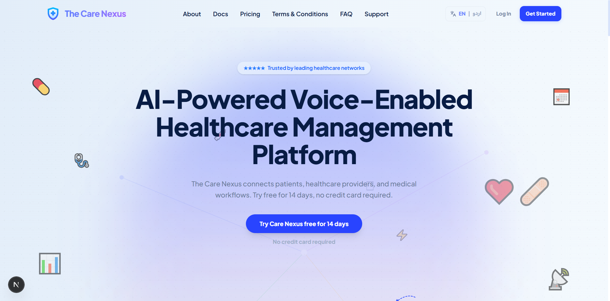

# The Care Nexus | Voice-Enabled Digital Healthcare Platform

**The Care Nexus** is a next-generation **SaaS healthcare platform** powered by the modern MERN ecosystem and AI-driven workflows.  
It connects **patients, doctors, and clinic administrators** through dedicated portals, enabling seamless healthcare management with real-time communication, multilingual support (English/Urdu), and a **voice-powered prescription system using Gemini/GROQ AI**.

From intelligent appointment handling to AI-assisted prescriptions and automated clinic analytics, every feature is designed to merge **efficiency, accessibility, and innovation** into one unified healthcare ecosystem.



<br />

<p align="center">
  <!-- 🌍 Live Project -->
  <a href="https://thecarenexus.vercel.app/" target="_blank">
    
  </a>

  <!-- ▶️ Live Demo -->
  <a href="#" target="_blank">
    
  </a>

  <!-- 📂 GitHub Repo -->
  <a href="#" target="_blank">
    
  </a>

  <!-- 📝 Case Study -->
  <a href="#" target="_blank">
    
  </a>

  <!-- ✍️ Blog -->
  <a href="#" target="_blank">
    
  </a>

  <!-- 🔗 LinkedIn Post -->
  <a href="#" target="_blank">
    
  </a>
</p>

---

## Tech Stack

- **🎨 Frontend:** Next.js 16+ (App Router, Turbopack), React 19+, Tailwind CSS v4
- **⚙️ Backend:** Node.js, Express.js
- **🧠 State Management:** Redux Toolkit Query (RTK Query)
- **🗄️ Database:** MongoDB Atlas + Mongoose
- **⚡ Cache:** Redis (Upstash)
- **🔐 Authentication & Security:** JWT, bcrypt
- **🤖 AI/NLP:** Google Gemini API, GROQ API (Chatbot, Speech-to-Text, Prescription Parsing)
- **💬 Real-time Communication:** Socket.IO
- **📅 Scheduling:** node-cron
- **🌐 Internationalization:** next-intl (English / Urdu with RTL support)
- **🚀 Deployment:** Vercel (Frontend), Render/AWS (Backend), MongoDB Atlas

---

## Features

### 👤 Patient Features

- 🔐 Secure authentication & role-based access
- 🏥 Book appointments with doctors & clinics
- 📅 View upcoming, past, and completed visits
- 📜 Access complete medical history & prescriptions
- 👨‍👩‍👧 Manage family member health records
- 🤖 AI health assistant (Gemini/GROQ chatbot)
- 💬 Real-time chat with doctors
- 🌐 Full bilingual support (English / Urdu)
- 📊 Personal health dashboard & timeline

### 🩺 Doctor & Clinic Features

- 🧑‍⚕️ Manage patient lists with full medical history
- 📝 Create AI-assisted voice prescriptions
- 🎙️ Speech-to-text prescription generation (Urdu/English)
- 📅 Appointment scheduling & queue management
- 📊 Clinic-wide analytics dashboard
- 💰 Revenue tracking & performance stats
- 👥 Staff & doctor management (clinic admin)
- 📦 Prescription lifecycle management

### ⚙️ System Features

- 🤖 AI-powered prescription parsing (structured output)
- 💬 Real-time chat system (Socket.IO)
- 🔔 Live notifications (appointments, chat, prescriptions)
- 📈 Automated analytics snapshots (cron jobs)
- 🌐 Full i18n support with RTL layout switching
- ⚡ Redis caching for sessions & performance
- 🔐 Secure token-based authentication (JWT + refresh rotation)
- 📡 Scalable REST + WebSocket hybrid architecture

---

## File & Folder Structure

```plaintext
client/
├── public/
├── src/
│ ├── app/
│ ├── components/
│ ├── redux/
│ ├── hooks/
│ ├── i18n/
│ ├── styles/
│ └── lib/

api/
├── controllers/
├── models/
├── routes/
├── services/
├── middleware/
├── jobs/
├── config/
└── index.js

socket/
├── index.js
├── package.json
└── .env
```

---

## Conclusion

The **Care Nexus** is a modern AI-powered healthcare ecosystem designed to simplify and enhance the interaction between patients, doctors, and clinics. By combining real-time communication, intelligent automation, multilingual support, and voice-driven AI workflows, it transforms traditional healthcare systems into a seamless digital experience.

This project reflects a strong focus on **scalability, usability, and real-world impact**, making healthcare management more accessible, efficient, and intelligent.

---

## Contact

<p align="center">
  <a href="https://your-portfolio-link.com" target="_blank">
    
  </a>

  <a href="https://www.linkedin.com" target="_blank">
    
  </a>

  <a href="https://github.com" target="_blank">
    
  </a>

  <a href="mailto:your-email@gmail.com">
    
  </a>
</p>
